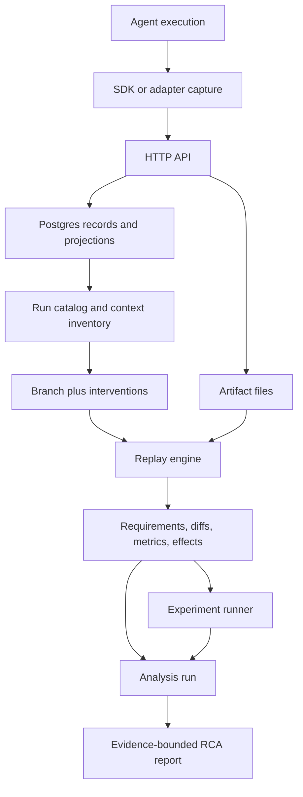

The full data flow is a loop: capture an observed run, inspect it, branch one hypothesis, replay, resolve fixture requirements, analyze effects, and report bounded conclusions.

## Capture Path

<Steps>
  <Step>App code or an adapter creates a run with `@isplay/sdk`.</Step>
  <Step>Context annotations, model calls, tool proposals, tool executions, checkpoints, and events are written through the API client.</Step>
  <Step>Large payloads become artifacts; durable records reference artifact IDs and hashes.</Step>
  <Step>The API stores base records and JSONB projections in Postgres.</Step>
</Steps>

## Investigation Path

<Steps>
  <Step>CLI, SDK, or analyst skill discovers the run catalog and context inventory.</Step>
  <Step>The analyst creates a branch from a checkpoint.</Step>
  <Step>One or more interventions define the controlled change.</Step>
  <Step>Replay applies policy, checks fixtures, emits comparison output, and may pause.</Step>
  <Step>Fixtures are added with provenance when needed.</Step>
  <Step>Effects and analysis records turn comparison output into evidence nodes, labels, and next actions.</Step>
</Steps>

## Important Boundaries

| Boundary | Why it exists |
| --- | --- |
| SDK/API | Capture can run in app processes while storage stays centralized. |
| Artifact/store | Payloads can be large and sensitive; records stay small. |
| Projection/event | Events preserve chronology; projections support direct lookup. |
| Replay/fixture | Divergent tool outputs remain explicit instead of implicit. |
| Effect/report | Ranking does not become a conclusion until validity labels are applied. |
